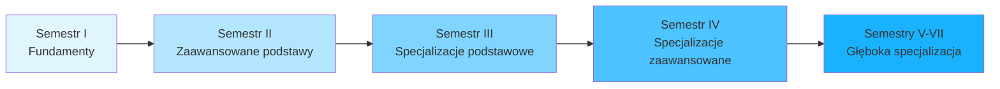
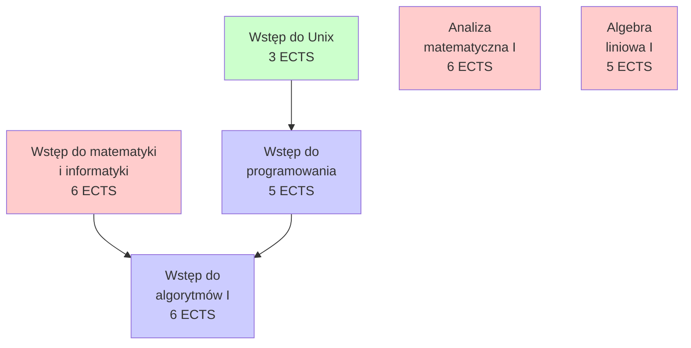
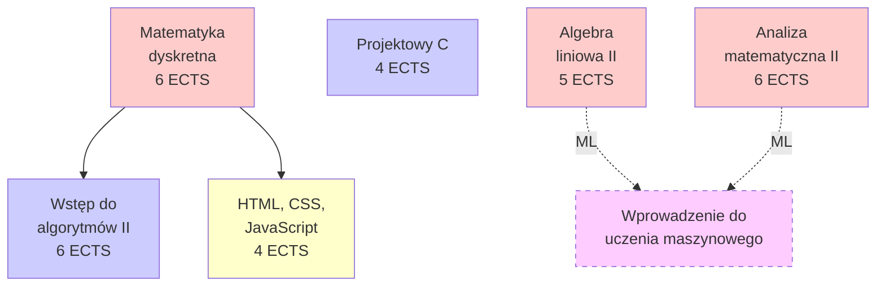
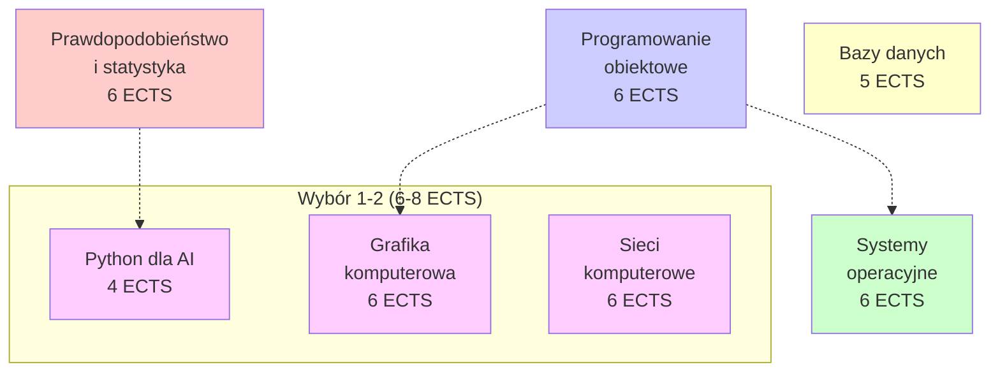
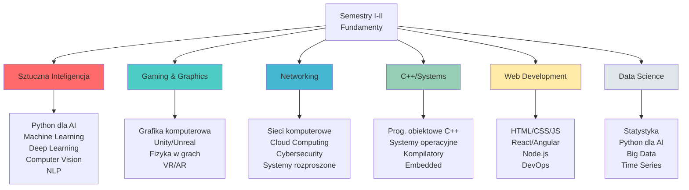
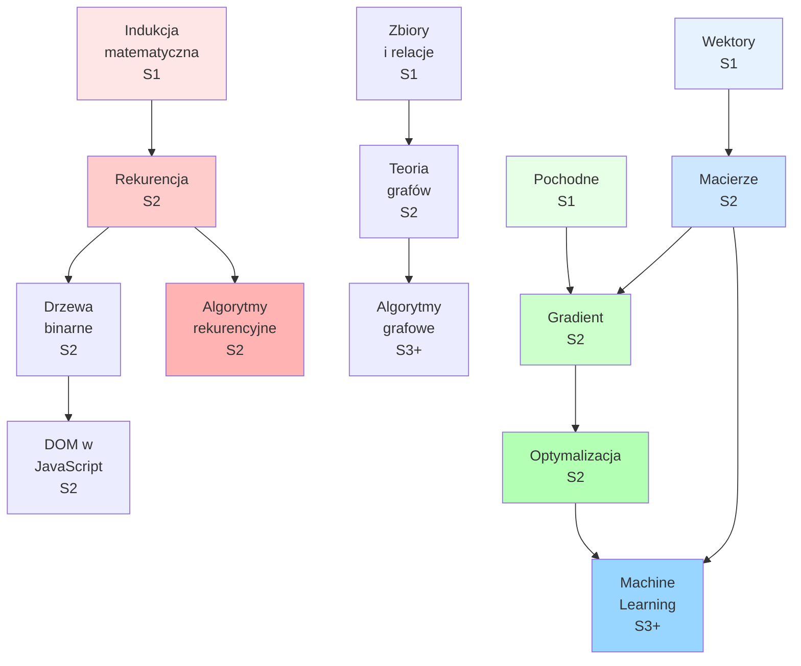

# Wizualizacja Programu Studiów

## Struktura całego programu

## Semestr I - Fundamenty (31 ECTS)

**Legenda:**
- 🔴 Czerwony: Matematyka
- 🟢 Zielony: Narzędzia i środowisko
- 🔵 Niebieski: Programowanie

## Semestr II - Zaawansowane podstawy (31 ECTS)

**Kluczowe zależności:**
- Rekurencja (MD, S2) wymaga indukcji (WMI, S1) ✅
- Listy i drzewa (WAlgo2, S2) wymagają rekurencji (MD, S2) ✅
- DOM (HTML, S2) wymaga drzew (MD, S2) ✅
- ML (AL2/AM2, S2) wymaga gradientu i macierzy ✅

## Semestr III - Pierwsze specjalizacje (29-31 ECTS)

## Ścieżki specjalizacyjne

## Graf kluczowych zależności

## Motywacja "PO CO?" dla każdej ścieżki

### Sztuczna Inteligencja
**Kluczowe przedmioty podstawowe (S1-S2):**
- Algebra liniowa I & II → reprezentacja danych jako wektory/macierze
- Analiza matematyczna II → gradient descent, trenowanie modeli
- Matematyka dyskretna → złożoność algorytmów ML

**Co to daje?**
Umiejętność budowy systemów AI od rozpoznawania obrazów po chatboty.

### Gaming i Grafika
**Kluczowe przedmioty podstawowe (S1-S2):**
- Algebra liniowa I & II → transformacje 3D, fizyka gier
- Programowanie obiektowe → architektura silników
- Wstęp do algorytmów → struktury danych dla game state

**Co to daje?**
Umiejętność tworzenia gier od małych indie po AAA.

### Networking
**Kluczowe przedmioty podstawowe (S1-S2):**
- Matematyka dyskretna → routing jako problem grafowy
- Unix → administracja serwerami
- Programowanie → implementacja protokołów

**Co to daje?**
Umiejętność budowy infrastruktury internetowej, chmur, systemów rozproszonych.

### C++/Programowanie Systemowe
**Kluczowe przedmioty podstawowe (S1-S2):**
- Wstęp do algorytmów → struktury danych w C
- Projektowy C → duże projekty w C
- Programowanie obiektowe → zaawansowany C++

**Co to daje?**
Umiejętność pisania niskopoziomowego, wydajnego kodu dla systemów krytycznych.

### Web Development
**Kluczowe przedmioty podstawowe (S1-S2):**
- HTML/CSS/JavaScript → frontend
- Bazy danych → backend
- Git/GitHub → workflow

**Co to daje?**
Umiejętność budowy pełnych aplikacji webowych od frontu po deployment.

### Data Science
**Kluczowe przedmioty podstawowe (S1-S2):**
- Prawdopodobieństwo i statystyka → modelowanie niepewności
- Algebra liniowa → operacje na danych
- Python → narzędzia analizy

**Co to daje?**
Umiejętność wyciągania wniosków z danych, predykcji, wizualizacji.

## Harmonogram ECTS

| Semestr | Obowiązkowe | Wybór | Suma |
|---------|-------------|-------|------|
| I       | 31          | 0     | 31   |
| II      | 31          | 0     | 31   |
| III     | 23          | 6-8   | 29-31|
| IV      | 17          | 9-12  | 26-29|
| V       | 0           | 24-28 | 24-28|
| VI      | 0           | 24-28 | 24-28|
| VII     | 15 (praca)  | 10-15 | 25-30|
| **SUMA**| **117-122** | **73-91** | **190-213** |

Minimalnie wymagane: 180 ECTS (licencjat), typowo: 210 ECTS

## Uwagi o zależnościach

### ✅ Poprawne sekwencje
1. **Indukcja (S1) → Rekurencja (S2)**
   - Student najpierw uczy się dowodzenia przez indukcję
   - Potem stosuje to w rekurencji i równaniach rekurencyjnych

2. **Drzewa binarne (S2) → DOM (S2)**
   - W matematyce dyskretnej student poznaje drzewa
   - Potem rozumie DOM jako drzewo w JavaScript

3. **Wektory (S1) → Macierze (S2) → ML (S2-S3)**
   - Geometryczna intuicja wektorów
   - Macierze jako transformacje
   - Wreszcie zastosowanie w uczeniu maszynowym

4. **Pochodne (S1) → Gradient (S2) → Optymalizacja (S2) → ML (S3)**
   - Funkcje 1D i ich pochodne
   - Rozszerzenie na wiele wymiarów (gradient)
   - Metody optymalizacji (gradient descent)
   - Trenowanie modeli ML

### ⚠️ Potencjalne problemy (do rozważenia)

1. **HTML/CSS/JS w semestrze II**
   - PRO: Student ma już podstawy programowania
   - CON: Event loop i DOM wymagają zaawansowanej wiedzy
   - **Sugestia:** Rozważyć przeniesienie do semestru 3 lub 4

2. **Współbieżność Analiza II + Algebra II + Matematyka dyskretna**
   - Trzy ciężkie przedmioty matematyczne w S2
   - **Sugestia:** Upewnić się o grupach gwiazdkowych dla chętnych

## Podsumowanie

Graf zależności zapewnia:
- ✅ Logiczną kolejność nauki (fundamenty → zaawansowane)
- ✅ Transparentność (student wie PO CO się uczy)
- ✅ Połączenie z przyszłą karierą (specjalizacje)
- ✅ Brak frustracji (student ma zawsze odpowiednie podstawy)
- ✅ Łatwość zarządzania programem (walidacja spójności)
